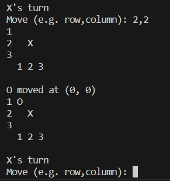
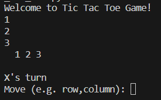

# Tic Tac Toe (Console-based)
This code uses a simple console-based Tic Tac Toe game with an AI opponent using the minimax algorithm with alpha-beta pruning to make optimal moves

## TicTacToePlayer Class
* represents an AI Tic Tac Toe player
* has a 3x3 board and 2 possible pieces ('X' and 'O')
* the constructor initializes the player's piece randomly and determines the opponenet's piece

## Game Logic
* The make_move method uses the minimax algorithm to select the best move for the AI player based on the current state of the board.
* The succ method generates all possible successor states for a given board state.
* The max_value and min_value methods implement the maximization and minimization steps of the minimax algorithm, with alpha-beta pruning for optimization.
* The opponent_move and place_piece methods handle the opponent's move and placing a piece on the board, respectively.

## Gameplay Loop
* Alternates turns between the AI player and the human player until there is a winner or a draw.
* The AI player's move is determined using the make_move method.
* The human player provides input for their move, and the game validates the input.
* The game continues until there is a winner or the board is full.

## Game Outcome
After the game loop, the final state of the board is printed, and the outcome (win, lose, or draw) is displayed based on the the game_value method

## Running the game
The main function initializes an instance of TicTacToePlayer and starts the game loop

## Example Gameplay

I want to place my X in the middle. I will input 2,2. The AI will then followup with its own action.

**Note:** The Java version is based on the Python version of this.